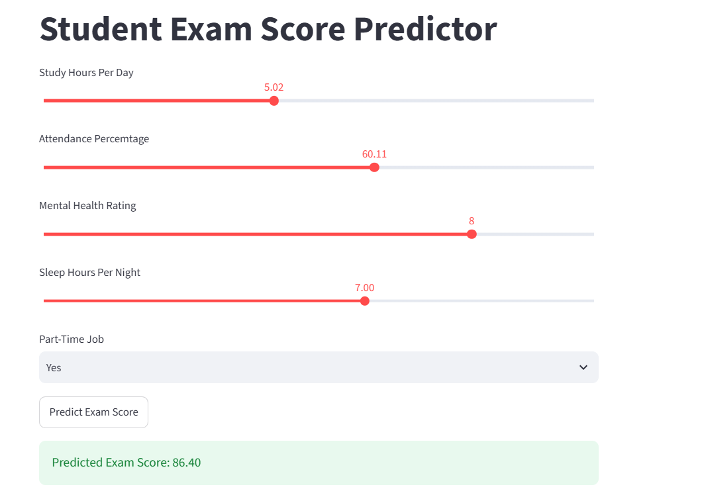
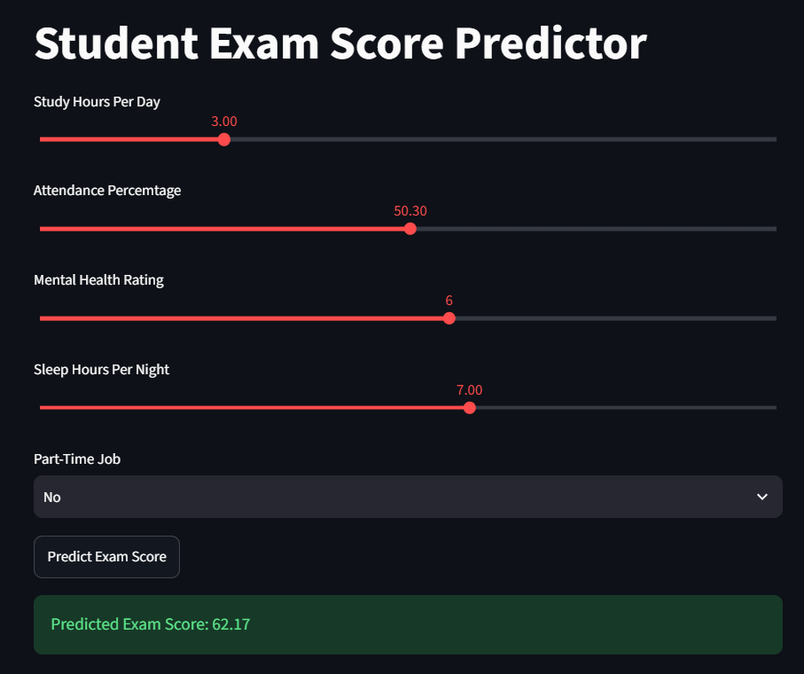

# 🎓 Student Success Prediction

A machine learning project that predicts a student's exam score based on their daily habits — study time, attendance, sleep, mental health, and part-time work — deployed as a live interactive web app using Streamlit.

🔗 **Live App:** [students-success-prediction-musfirah.streamlit.app](https://students-success-prediction-musfirah.streamlit.app/)

## 📋 Overview

Using a dataset of student habits and academic outcomes, this project explores how lifestyle factors relate to exam performance, then trains and compares regression models to predict a student's exam score. The best-performing model is deployed in a simple, interactive web app where anyone can enter their own habits and get an instant predicted exam score.

## 📊 Dataset

The dataset (`student_habits_performance.csv`) contains **1,000 student records** with **16 features**, including:

`student_id`, `age`, `gender`, `study_hours_per_day`, `social_media_hours`, `netflix_hours`, `part_time_job`, `attendance_percentage`, `sleep_hours`, `diet_quality`, `exercise_frequency`, `parental_education_level`, `internet_quality`, `mental_health_rating`, `extracurricular_participation`, `exam_score`

## 📈 Exploratory Data Analysis

Before modeling, the project runs a full exploratory analysis to understand the data:

- **Distribution histograms** for all numeric features
- **Category distribution bar charts** for gender, part-time job status, diet quality, parental education level, internet quality, and extracurricular participation
- **Scatter plots** of each numeric feature (study hours, social media hours, Netflix hours, attendance, sleep, exercise, mental health) against exam score
- **Box plots** comparing exam scores across each categorical group

These visualizations help identify which habits most strongly relate to academic performance before selecting features for the model.

## 🧠 Machine Learning Pipeline

1. **Load & explore** — inspect distributions and relationships between habits and exam scores
2. **Feature selection** — narrow down to the most relevant predictors: `study_hours_per_day`, `attendance_percentage`, `mental_health_rating`, `sleep_hours`, `part_time_job`
3. **Encode categorical data** — `part_time_job` encoded numerically via `LabelEncoder`
4. **Train-test split** — 80/20 split
5. **Train & tune three regression models** using `GridSearchCV` (5-fold cross-validation):
   - Linear Regression
   - Decision Tree Regressor
   - Random Forest Regressor
6. **Evaluate models** using RMSE and R² Score, selecting the best-performing model based on lowest RMSE
7. **Save the best model** with `joblib` for reuse in the web app
8. **Deploy** — an interactive Streamlit app where users input their own habits and receive a live predicted exam score

## 🖼️ Screenshots

**Prediction — Higher Study Hours & Attendance**



**Prediction — Lower Study Hours & Attendance**



## 🛠️ Tech Stack


## 📁 Files

| File | Purpose |
|---|---|
| `student_habits_performance.csv` | Raw student habits & performance dataset |
| `project.py` | EDA, model training, tuning, evaluation, and model export |
| `app.py` | Streamlit web app for live exam score prediction |
| `best_model.pkl` | Saved, trained regression model used by the app |
| `requirements.txt` | Project dependencies |
| `screenshots/` | Screenshots of the deployed app in action |

## ▶️ How to Run

**Train the model:**
```bash
pip install -r requirements.txt
python project.py
```

**Run the app locally:**
```bash
streamlit run app.py
```

Or simply try the live deployed version: [students-success-prediction-musfirah.streamlit.app](https://students-success-prediction-musfirah.streamlit.app/)

## 🔮 Possible Improvements

- Incorporate additional features (social media hours, Netflix hours, diet quality) into the final model
- Add model performance metrics directly to the app UI for transparency
- Add input validation and confidence intervals around predictions
- Experiment with additional models (e.g. Gradient Boosting, XGBoost)

## 👩‍💻 Author

**Musfirah Kashan**
Full Stack Web Developer | Data Science & AI/ML 

- 🔗 GitHub: [@musfirah-kashan](https://github.com/musfirah-kashan)
- 💼 LinkedIn: [musfirah-kashan](https://www.linkedin.com/in/musfirah-kashan-487aa626a/)
- 📧 Email: musfirah22feb@gmail.com

## 📄 License

This project is licensed under the **MIT License** — see the [LICENSE](LICENSE) file for details.
